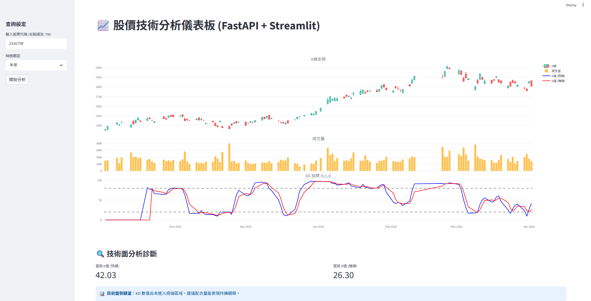

# 📈 台灣股市技術分析儀表板 (FastAPI + Streamlit)


## 🖼️ 成果展示


---

## 🌟 專案簡介
這是一個結合 **FastAPI 後端數據處理** 與 **Streamlit 前端視覺化** 的全棧股票分析工具。本專案採用前後端分離的微服務架構開發，提供即時台/美股數據抓取、自動化 KD 指標計算，以及智能盤勢診斷功能。

## 🚀 核心亮點 (Core Features)
* **前後端分離架構 (Decoupled Architecture)**：
    * **後端 (FastAPI)**：負責高效能數據抓取、清洗與技術指標 (KD) 運算。
    * **前端 (Streamlit)**：提供流暢的互動式 UI，支援自定義股票代碼輸入與時間範圍選擇。
* **專業技術指標診斷**：
    * 整合 `pandas_ta` 計算 **9-3-3 KD 指標**。
    * 內建「智能診斷系統」，自動判斷**低檔黃金交叉**與**高檔死亡交叉**，並給予視覺化提示。
* **互動式視覺化圖表**：使用 `Plotly` 繪製連動的 K線圖、成交量圖與 KD 走勢圖。

---

## 🛠️ 技術堆疊 (Tech Stack)

| 類別 | 技術工具 |
| :--- | :--- |
| **開發語言** | Python 3.x |
| **後端框架** | FastAPI, Uvicorn |
| **前端框架** | Streamlit |
| **技術分析** | Pandas_TA (Stochastic Oscillator) |
| **數據來源** | Yahoo Finance (yfinance) |

---

## 📦 本地安裝與快速啟動

### 1. 安裝環境
```bash
# 複製專案
git clone [https://github.com/tedhuang31-kobe/twstockweb-apply-fastAPI.git](https://github.com/tedhuang31-kobe/twstockweb-apply-fastAPI.git)
cd StockApply

# 安裝必要套件
pip install -r requirements.txt

2. 啟動服務 (需開啟兩個終端機視窗)
視窗 A (啟動後端 API 伺服器):

Bash
python api.py
API 預設運行於: http://127.0.0.1:8000

視窗 B (啟動前端網頁介面):

Bash
streamlit run webapp.py
網頁將自動開啟於: http://localhost:8501

💡 開發心得與架構思考 (Architecture Insights)
作為一名從 BI Analyst 轉向 Cloud Architect 的開發者，我在本專案中實踐了以下思維：

資料工程挑戰：處理了 yfinance 在不同版本中產生的 MultiIndex 欄位問題，並針對 JSON 傳輸時不支援 NaN (空值) 的特性進行了數據清洗 (fillna)，確保 API 的穩定性與資料傳輸的健壯性。

雲端擴展性考量：採用 API 驅動設計，讓前端與後端邏輯完全解耦。未來可輕鬆將後端遷移至 AWS Lambda 或 ECS 容器化部署，達成真正的無伺服器 (Serverless) 或微服務架構。

商業邏輯轉換：不只是顯示數字，而是透過程式碼將技術分析邏輯 (KD 策略) 轉化為直觀的 UI 提示，展現數據輔助決策 (Data-Driven Decision Making) 的實戰價值。